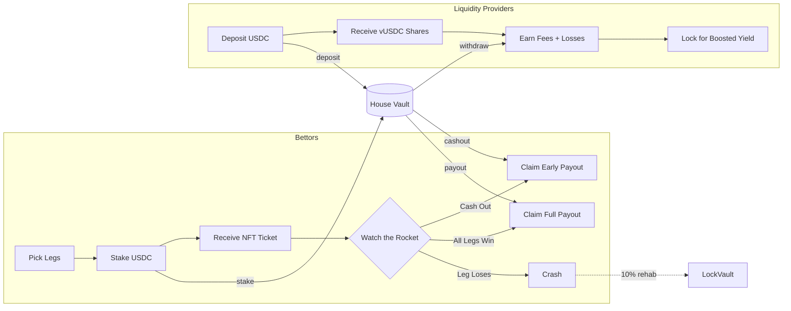
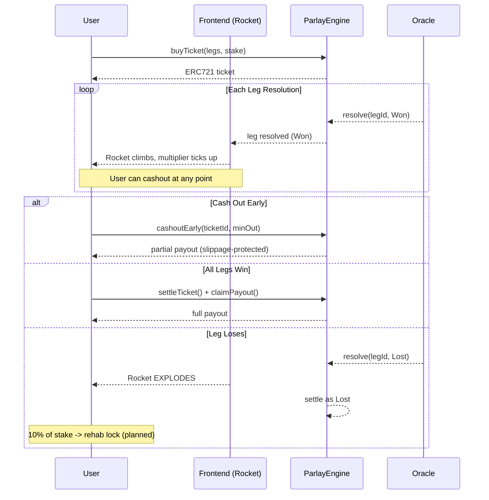
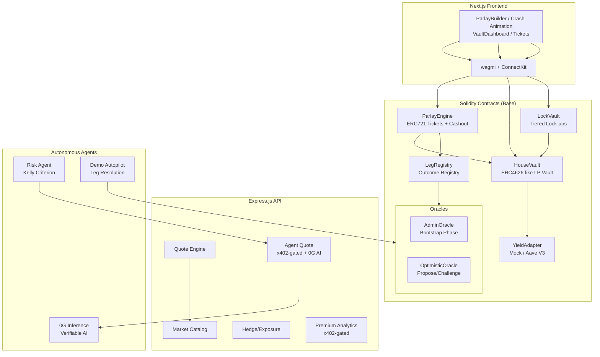
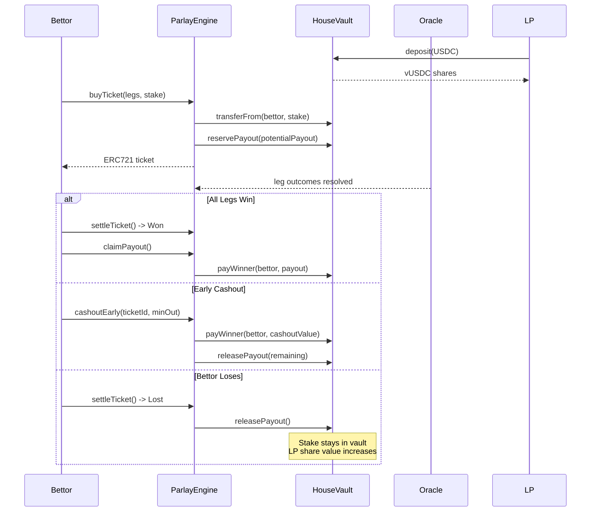
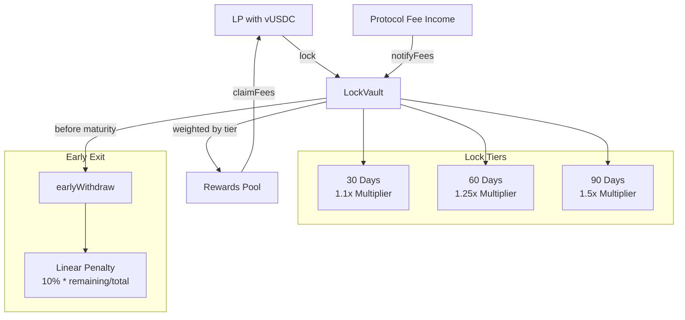
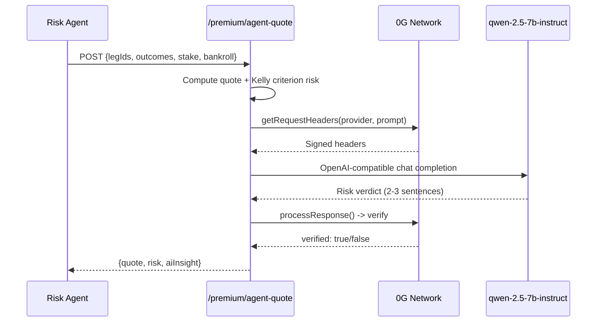
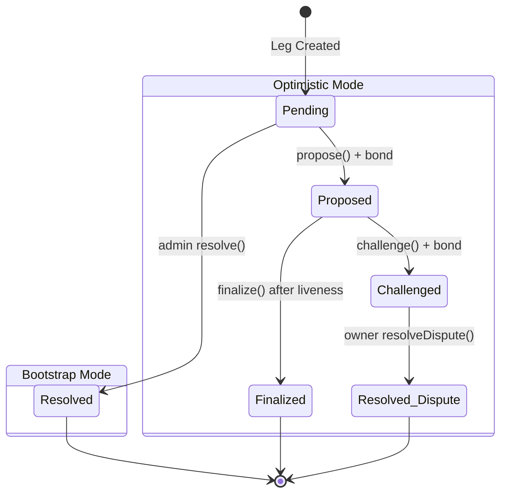

# ParlayVoo

**Crash-Parlay AMM on Base.**

Combine multiple prediction outcomes into high-multiplier parlay tickets, backed by a permissionless LP vault. Watch your multiplier climb as each leg resolves -- cash out before the crash, or ride to full payout. AI agents discover markets, assess risk, and check protocol health via MCP tools. Built at ETHDenver 2026.

---

## How It Works

Users pick 2-5 binary outcomes (legs), stake USDC, and receive an ERC721 parlay ticket with a combined multiplier. As each leg resolves favorably, the multiplier climbs like a rocket. Cash out at any point, or watch it crash if a leg loses. LPs deposit USDC into the House Vault to underwrite bets and earn from fees + losing stakes. The protocol is fully on-chain with permissionless settlement.



---

## The Crash Game

The core differentiator: tickets are live instruments with real-time cashout. A rocket climbs as each leg resolves favorably; it explodes when a leg loses.



### Payout Modes

| Mode | Description |
|---|---|
| **Classic** | Win or lose. Full multiplier payout if all legs resolve correctly. |
| **Progressive** | Partial payout increases as each leg resolves. Claim incrementally. |
| **Early Cashout** | Exit at any point before all legs resolve. Value derived from effective stake and won-leg multiplier, discounted by a scaled penalty based on unresolved legs (mirrors `ParlayMath.computeCashoutValue`). |

---

## Architecture



---

## Fund Flow



---

## Lock Vault & Fee Distribution



---

## Rehab Mode (Loser-to-LP Conversion) -- Planned

> **Status:** UI mockup implemented (RehabCTA + RehabLocks components with mock data). Contract-level loss routing is designed but not yet deployed. See `docs/REHAB_MODE.md` for the full spec.

The target design: when a ticket crashes, 10% of the losing stake is converted to vUSDC shares and force-locked for 120 days. During that period the locked shares earn fee income, giving losing bettors exposure to LP economics.

```
$100 losing stake (target design)
  |-- $80 (80%)  -> stays in vault (LP share price appreciation)
  |-- $10 (10%)  -> AMM liquidity pool
  |-- $10 (10%)  -> rehab lock (force-locked vUSDC, 120 days)
```

After 120 days: withdraw shares or re-lock at 1.55x boosted weight. The rehab CTA is displayed on the ticket detail page when a ticket is lost (UI exists with mock data for demo purposes).

---

## 0G Verifiable AI Integration

The agent-quote endpoint integrates with the [0G Compute Network](https://0g.ai/) for verifiable AI risk analysis. When `ZG_PRIVATE_KEY` is set, each quote request includes an AI-generated risk verdict from a model running on 0G's decentralized inference network.



Key properties:
- **Verifiable**: Responses are cryptographically verified via 0G's `processResponse()` -- the AI can't silently change its answer
- **Best-effort**: 5-second timeout, gracefully omitted if unavailable
- **Model**: `qwen-2.5-7b-instruct` on 0G testnet (configurable)

---

## Autonomous Risk Agent

The risk agent (`scripts/risk-agent.ts`) is a fully autonomous Kelly criterion betting agent that:

1. Discovers markets from the services API
2. Builds candidate parlay combinations
3. Evaluates each via `/premium/agent-quote` (x402-gated, includes 0G AI insight)
4. Applies configurable confidence thresholds and risk tolerance
5. Executes on-chain buys when conditions are met (or logs decisions in dry-run mode)

```bash
# Dry run (default) -- logs decisions without executing
make risk-agent-dry

# Live execution
make risk-agent
```

Configuration via environment variables:

| Variable | Default | Description |
|---|---|---|
| `DRY_RUN` | `true` | Skip on-chain execution |
| `MAX_STAKE_USDC` | `10` | Maximum stake per ticket |
| `MAX_LEGS` | `3` | Maximum legs per parlay (2-5) |
| `RISK_TOLERANCE` | `moderate` | `conservative` / `moderate` / `aggressive` |
| `CONFIDENCE_THRESHOLD` | `0.6` | Minimum confidence to act |
| `AGENT_PAYOUT_MODE` | `0` | 0=Classic, 1=Progressive, 2=EarlyCashout |
| `LOOP_INTERVAL_MS` | `30000` | Cycle interval (0 = run once) |
| `SERVICES_URL` | `http://localhost:3001` | Services API base URL |

---

## Oracle System



The settlement mode is set at ticket purchase time based on `bootstrapEndsAt`:
- **Before**: Admin oracle (fast resolution for launch)
- **After**: Optimistic oracle (propose/challenge with USDC bonds)

---

## Project Structure

```
parlaycity/
├── apps/web/                    # Next.js 14 frontend (Vercel-deployed)
│   └── src/
│       ├── app/                 # Pages: /, /vault, /tickets, /ticket/[id], /about
│       │   └── api/             # Chat (/api/chat), MCP (/api/mcp), Markets, Agent-Quote
│       ├── components/          # ParlayBuilder, MultiplierClimb, ChatPanel,
│       │                        # VaultDashboard, TicketCard, FTUESpotlight, RehabCTA
│       └── lib/                 # wagmi config, hooks, ABIs, contracts, cashout
│           └── mcp/             # MCP tool implementations (6 tools)
├── packages/
│   ├── contracts/               # Foundry (Solidity)
│   │   ├── src/core/            # HouseVault, ParlayEngine, LegRegistry, LockVault
│   │   ├── src/oracle/          # AdminOracle, OptimisticOracle
│   │   ├── src/yield/           # AaveYieldAdapter, MockYieldAdapter
│   │   ├── src/libraries/       # ParlayMath
│   │   ├── script/              # Deploy.s.sol
│   │   └── test/                # Unit, fuzz, invariant, integration tests
│   ├── services/                # Express.js API (quotes, markets, exposure,
│   │   └── src/premium/         # x402-gated: sim, risk-assess, agent-quote, 0G AI)
│   └── shared/                  # TypeScript math, types, schemas (mirrors Solidity)
├── scripts/
│   ├── risk-agent.ts            # Autonomous Kelly criterion betting agent
│   ├── demo-autopilot.ts        # Auto-resolve legs + settle for demos
│   └── lib/                     # Shared script utilities (env loading, BigInt safety)
├── Makefile                     # Dev, test, deploy, agent, demo commands
└── package.json                 # pnpm workspace root
```

---

## Tech Stack

| Layer | Technology |
|---|---|
| Smart Contracts | Solidity 0.8.24, Foundry, OpenZeppelin 5.x |
| Frontend | Next.js 14, React 18, TypeScript, Tailwind CSS |
| Wallet | wagmi 2, viem 2, ConnectKit |
| API | Express.js, Zod, x402 payment protocol |
| AI Chat | Vercel AI SDK, Claude (Anthropic), MCP JSON-RPC |
| AI Inference | 0G Compute Network (verifiable inference), OpenAI SDK |
| Testing | Forge (unit/fuzz/invariant), Vitest, Testing Library |
| Chain | Base (Anvil for local, Base Sepolia for testnet) |
| Workspace | pnpm 8 workspaces |

---

## API Endpoints

### Express.js Services (port 3001)

| Route | Auth | Description |
|---|---|---|
| `GET /markets` | Public | Seed market catalog with legs and probabilities |
| `POST /quote` | Public | Off-chain parlay quote (matches on-chain execution) |
| `GET /exposure` | Public | Mock hedger exposure tracking |
| `POST /premium/sim` | x402 | Analytical simulation |
| `POST /premium/risk-assess` | x402 | Kelly criterion risk advisor |
| `POST /premium/agent-quote` | x402 | Combined quote + risk + 0G AI insight for agents |
| `GET /vault/health` | Public | Vault health assessment |
| `GET /vault/yield-report` | Public | Yield optimization report |
| `GET /health` | Public | Service health check |

x402 endpoints require an `X-402-Payment` header. In dev/test, any non-empty value is accepted.

### Next.js API Routes (Vercel-deployed)

| Route | Auth | Description |
|---|---|---|
| `POST /api/chat` | API key | AI chat endpoint (Vercel AI SDK + Claude) |
| `GET/POST /api/mcp` | Public | MCP JSON-RPC endpoint (tools/list, tools/call) |
| `GET /api/markets` | Public | Market catalog (serverless, no Express dependency) |
| `POST /api/premium/agent-quote` | Public | Agent quote + risk assessment (serverless) |

### MCP Tools

Six protocol tools exposed via the `/api/mcp` endpoint for AI agent consumption:

| Tool | Description |
|---|---|
| `list_markets` | List available betting markets, optionally filter by category |
| `get_quote` | Get parlay quote -- multiplier, payout, fees for given legs and stake |
| `assess_risk` | Kelly criterion risk assessment with BUY/REDUCE_STAKE/AVOID recommendation |
| `get_vault_health` | Vault TVL, reserved exposure, free liquidity, utilization % |
| `get_leg_status` | Status of a specific betting leg by ID |
| `get_protocol_config` | Fee structure, limits, contract addresses, chain info |

---

## Contracts

| Contract | Description |
|---|---|
| `HouseVault` | ERC4626-like LP vault. Deposits USDC, mints vUSDC shares. Manages exposure reserves, yield deployment, fee routing (90/5/5), and LP payouts. |
| `ParlayEngine` | Core betting engine. Mints ERC721 ticket NFTs. Validates legs, computes multipliers via `ParlayMath`, reserves vault exposure. Supports Classic, Progressive, and EarlyCashout payout modes. |
| `LegRegistry` | Admin-managed registry of betting outcomes with implied probabilities (PPM). Each leg references an oracle adapter. |
| `LockVault` | Lock vUSDC shares for 30/60/90 days. Earns boosted fee share via Synthetix-style weighted reward distribution. Early withdraw with linear penalty. |
| `ParlayMath` | Pure library for multiplier, edge, payout, progressive payout, and cashout value calculations. Mirrored in TypeScript. |
| `AdminOracleAdapter` | Owner-resolved oracle for bootstrap phase. |
| `OptimisticOracleAdapter` | Propose/challenge oracle with USDC bonds and liveness window. |
| `AaveYieldAdapter` | Routes idle vault USDC to Aave V3 on Base for supply APY. |
| `MockUSDC` | 6-decimal test ERC20 with public mint (capped at 10K per call). |

---

## Getting Started

### Prerequisites

- [Node.js](https://nodejs.org/) >= 18
- [pnpm](https://pnpm.io/) >= 8
- [Foundry](https://getfoundry.sh/) (forge, anvil, cast)

### Install

```bash
git clone https://github.com/roman-popenov/parlaycity.git
cd parlaycity
make setup     # pnpm install + forge install
```

### Local Development

The fastest way to start the full stack:

```bash
make dev       # Starts anvil + deploys contracts + services (3001) + web (3000)
make dev-stop  # Tear down all services
make dev-status # Check what's running
```

Or start components individually:

```bash
make chain          # Anvil only (8545)
make deploy-local   # Deploy contracts + sync .env.local
make dev-services   # Express API on 3001
make dev-web        # Next.js on 3000
```

### Demo Mode

```bash
# Buy a ticket in the UI, then watch it auto-resolve:
make demo-autopilot

# Force a crash on the last leg (100% crash rate):
make demo-autopilot-crash

# Run the autonomous risk agent (dry run):
make risk-agent-dry
```

### Environment Variables

`apps/web/.env.local` is auto-generated by `make deploy-local` via `scripts/sync-env.sh`. Only `NEXT_PUBLIC_WALLETCONNECT_PROJECT_ID` needs manual setup.

For 0G AI integration, set in the services environment:

```env
ZG_PRIVATE_KEY=0x...              # 0G testnet wallet private key
ZG_AUTO_FUND_LEDGER=true          # Auto-fund 0G ledger (4 A0GI)
```

### Wallet Setup

1. Add Foundry network to your wallet: RPC `http://127.0.0.1:8545`, Chain ID `31337`
2. Import an Anvil test account (private key from `anvil` output)
3. Mint test USDC: `cast send <USDC_ADDRESS> "mint(address,uint256)" <YOUR_WALLET> 10000000000 --rpc-url http://127.0.0.1:8545 --private-key <ANVIL_KEY>`

---

## Testing

```bash
make test-contracts    # Solidity tests (unit + fuzz + invariant + integration)
make test-services     # TypeScript service tests (vitest)
make test-all          # Both
make gate              # Full quality gate: tests + typecheck + build
make coverage          # Forge coverage report
make snapshot          # Gas benchmarks
```

### Test Coverage

| Suite | Tests |
|---|---|
| `HouseVault.t.sol` | Deposit/withdraw share math, reserve/release/pay, utilization cap, yield adapter integration |
| `ParlayEngine.t.sol` | Ticket lifecycle, multiplier/fees, settlement (win/loss/void/partial void), cashout, progressive claim |
| `LegRegistry.t.sol` | CRUD, validation, access control |
| `LockVault.t.sol` | Lock positions, tier multipliers, rewards, early withdrawal penalty |
| `AdminOracle.t.sol` | Resolve, double-resolve prevention |
| `OptimisticOracle.t.sol` | Propose, challenge, finalize, dispute resolution, bond slashing |
| `ParlayMathFuzz.t.sol` | Fuzz: no overflow for 1-5 legs, payout consistency, edge monotonicity |
| `VaultInvariant.t.sol` | Invariant: `totalReserved <= totalAssets`, share/asset consistency |
| `Integration.t.sol` | Full lifecycle: win+claim, loss, partial void, lock vault, yield |
| `quote.test.ts` | 30+ tests for shared math, parsers, schemas |
| `api.test.ts` | API integration tests (markets, quotes, exposure, x402) |
| `agent-quote.test.ts` | Agent quote endpoint: x402 gating, response shape, quote math, risk profiles, correlation detection, aiInsight |
| `risk-compute.test.ts` | Kelly criterion, risk tolerance profiles, boundary conditions |

---

## Key Design Decisions

**Crash-parlay mechanic**: Tickets are live instruments, not fire-and-forget bets. The multiplier climbs as each leg resolves favorably and crashes when a leg loses. Users choose their own exit point via early cashout.

**Vault-backed exposure**: The engine never holds USDC. All stakes go directly to the vault, and exposure is reserved 1:1. LP share value only changes through bet outcomes, not custody risk.

**Permissionless settlement**: Anyone can call `settleTicket()` once oracle data is available. No keeper dependency for resolution.

**Partial void handling**: If some legs in a parlay are voided, the multiplier is recalculated on surviving legs rather than voiding the entire ticket. Falls back to full void only if fewer than 2 legs remain.

**Synthetix-style fee distribution**: The LockVault uses a global accumulator (`accRewardPerWeightedShare`) weighted by lock tier multipliers. O(1) per claim, no per-user iteration.

**Shared math**: `ParlayMath.sol` and `packages/shared/src/math.ts` implement identical integer arithmetic. Off-chain quotes match on-chain execution exactly.

**Yield on idle capital**: The vault's `totalAssets()` includes capital deployed to Aave via the yield adapter. Share prices reflect accrued yield with no settlement lag. A configurable buffer (default 25%) always stays local to cover payouts.

**Verifiable AI** (integrated): Risk analysis uses 0G's decentralized inference network with cryptographic verification. The AI verdict is included in agent-quote responses when `ZG_PRIVATE_KEY` is configured, but is best-effort -- the protocol never depends on it for correctness.

**Rehab as retention** (planned): Target design where a portion of losing stakes become force-locked LP positions, giving losers exposure to LP economics. UI components exist with mock data; contract-level loss routing is designed but not yet deployed.

---

## License

MIT
