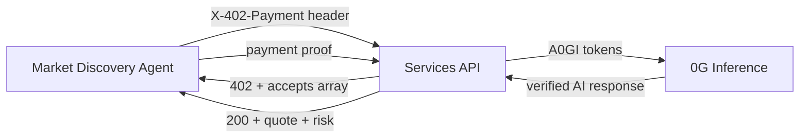

# ParlayCity Architecture

## Overview

ParlayCity is an onchain parlay betting platform on Base. Users build 2-5 leg parlays, LPs provide house liquidity via a vault, and settlement uses a hybrid model (fast admin resolution for bootstrap, optimistic challenge-based resolution thereafter). Autonomous agents handle market discovery and settlement -- humans make all betting decisions.

## System Diagram

```mermaid
flowchart TB
    subgraph "External Data Sources"
        BDL[BallDontLie API<br/>Real NBA Games]
    end

    subgraph "Autonomous Agents"
        MA[Market Discovery Agent<br/>scripts/market-agent.ts]
        SB[Settler Bot<br/>scripts/settler-bot.ts]
    end

    subgraph "Frontend -- Next.js 14"
        UI[Parlay Builder / Vault / Tickets / Ticket Detail]
    end

    subgraph "Services API :3001"
        MK[/markets<br/>Multi-category catalog]
        QT[/quote]
        AQ[/premium/agent-quote<br/>x402-gated]
        VH[/vault/health<br/>/vault/yield-report]
        EX[/exposure]
    end

    subgraph "0G Compute Network"
        ZG[0G Inference<br/>A0GI token payment]
    end

    subgraph "Base Sepolia -- Contracts"
        PE[ParlayEngine<br/>ERC-721 tickets]
        HV[HouseVault<br/>ERC-4626 vault]
        LR[LegRegistry]
        LV[LockVault<br/>Synthetix rewards]
        OA[AdminOracleAdapter]
        OO[OptimisticOracleAdapter]
        PM[ParlayMath<br/>pure library]
    end

    subgraph "Human Users"
        HU[Browse markets<br/>Buy tickets<br/>Cashout / Claim<br/>Deposit / Lock]
    end

    %% Agent flows
    BDL --> MA
    MA -->|createLeg| LR
    MA -->|resolve| OA
    MA -->|x402 payment| AQ
    AQ -->|A0GI tokens| ZG
    SB -->|settleTicket| PE
    SB -->|canResolve| OA

    %% Human flows
    HU -->|wagmi/viem| UI
    UI --> MK
    UI --> QT
    UI --> VH
    HU -->|buyTicket / cashoutEarly| PE
    HU -->|deposit / withdraw| HV
    HU -->|lock / unlock| LV

    %% Contract internals
    PE -->|reserve / release / pay| HV
    PE --> PM
    HV -->|routeFees / notifyFees| LV
    LR --> OA
    LR --> OO
```

## Contract Architecture

### HouseVault
ERC4626-like vault holding USDC. LPs deposit to earn the house edge. Tracks reserved exposure for active tickets. Pull-based payouts. Fee routing: 90% to LockVault lockers, 5% to safety buffer, 5% stays in vault (via `routeFees`).

### LegRegistry
Registry of betting legs (questions). Each leg has a probability, cutoff time, oracle adapter reference, and optional `sourceRef` for external data provenance (e.g., `bdl:game:12345`). Legs are created by the Market Discovery Agent or admin.

### ParlayEngine
Core engine that mints ERC-721 ticket NFTs. Validates parlay construction, computes multipliers/fees via ParlayMath library, manages settlement lifecycle. Supports three payout modes: Classic, Progressive, and EarlyCashout.

### LockVault
Staking contract for vUSDC shares. 30/60/90-day lock tiers with weight multipliers (1.1x/1.25x/1.5x). Synthetix-style fee accumulator distributes 90% of protocol fees to lockers, weighted by lock tier.

### ParlayMath
Pure library mirrored exactly in TypeScript (`packages/shared/src/math.ts`). Computes multipliers, edge, payout, progressive payout, and cashout values. PPM scale (1e6) for probability, BPS (1e4) for fees.

### Oracle Adapters
Pluggable settlement via `IOracleAdapter` interface:
- **AdminOracleAdapter**: Owner (or Market Discovery Agent) resolves legs directly. Used during bootstrap.
- **OptimisticOracleAdapter**: Permissionless propose/challenge with bonds and liveness window. Production path.

### Hybrid Settlement
`bootstrapEndsAt` timestamp determines mode at ticket purchase time. Before = FAST (admin resolved). After = OPTIMISTIC (challenge-based). Mode is immutable per ticket.

## Autonomous Agents

Agents handle protocol infrastructure. Humans make all betting decisions.

### Market Discovery Agent (`scripts/market-agent.ts`)

Discovers real NBA games from BallDontLie API, registers them as bettable legs on LegRegistry, and auto-resolves completed games via AdminOracleAdapter. Optionally pays for x402 risk assessment (with 0G AI inference) before resolution.

```
BDL API  -->  Discovery (upcoming games)  -->  createLeg() on LegRegistry
BDL API  -->  Resolution (completed games) -->  resolve() on AdminOracleAdapter
                                           -->  x402 /agent-quote (optional AI insight from 0G)
```

### Settler Bot (`scripts/settler-bot.ts`)

Permissionless settlement keeper. Polls for tickets whose legs have all been resolved, then calls `settleTicket()` to finalize payouts and release vault reserves.

```
Poll ticketCount  -->  Check canResolve for each leg  -->  settleTicket()
```

### Payment Flows



1. **x402 (USDC on Base):** Agent pays for risk assessment via x402 payment header. Services verifies on-chain USDC transfer via facilitator.
2. **0G Compute (A0GI tokens):** Services API optionally invokes 0G inference for AI risk narrative. Each call costs A0GI tokens on the 0G testnet.

## Offchain Services

Express-based API on port 3001:
- **`/markets`**: Multi-category catalog (7 seeded categories + BDL NBA). Category filtering via `?category=`.
- **`/markets/categories`**: Available category list.
- **`/quote`**: Parlay quote computation using shared math library.
- **`/exposure`**: Exposure tracking (mock).
- **`/premium/sim`**: x402-gated Monte Carlo simulation.
- **`/premium/risk-assess`**: x402-gated risk assessment.
- **`/premium/agent-quote`**: x402-gated combined quote + risk for autonomous agents, with optional 0G AI insight.
- **`/vault/health`**: Vault utilization and health metrics.
- **`/vault/yield-report`**: LP yield analysis.

Catalog subsystem: `registry.ts` (unified leg map merging seed + BDL), `seed.ts` (7 hardcoded categories), `bdl.ts` (live NBA markets via BallDontLie API, 5-min cache).

## Security Model

See [THREAT_MODEL.md](THREAT_MODEL.md) for full analysis.

Key properties:
- SafeERC20 + ReentrancyGuard on all token interactions
- Pull-based payouts (no push transfers)
- Utilization caps prevent vault insolvency (80% max utilization, 5% max single payout)
- Oracle adapter isolation (swap without touching engine)
- Pausable emergency stop on all contracts
- Permissionless settlement (no keeper dependency)
- Engine never holds USDC (stateless routing layer)
